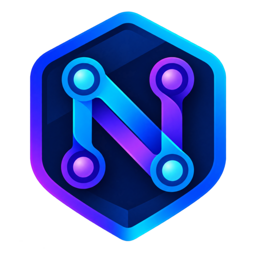

<p align="center">
  
</p>

<h1 align="center">Nexus Panel</h1>

Nexus Panel — панель агрегации и управления узлами **3x-ui** и **Remnawave**: клиенты, SUB/JSON-подписки, маршрутизация, трафик, Telegram и синхронизация выбранного inbound.

[](https://github.com/dagmagnat/Nexus-Panel)


## Возможности

- добавление и мониторинг обычных 3x-ui и Remnawave-узлов;
- точная загрузка параметров указанного `Inbound ID` до сохранения узла;
- поддержка VLESS, XHTTP, Reality/TLS/NONE и параметров выбранного транспорта;
- отображение upload, download и общего расхода трафика выбранного inbound;
- управление клиентами и синхронизация клиентов с выбранными узлами;
- генерация SUB и JSON-подписок;
- собственный логотип в панели, favicon, Apple Touch Icon и фирменная публичная страница подписки;
- маршрутизация, перенаправление трафика, Telegram-бот и резервные копии;
- адаптивный интерфейс со светлой и тёмной темами.

## Быстрая установка

Требуется VPS с Linux, root-доступом и открытыми портами. Для автоматического HTTPS домен должен указывать на этот сервер, а порты `80` и `443` не должны быть заняты другим Nginx, Apache или Caddy.

```bash
sudo -i
apt-get update && apt-get install -y curl
curl -fsSL https://raw.githubusercontent.com/dagmagnat/Nexus-Panel/main/install.sh -o /tmp/nexus-panel-install.sh
bash /tmp/nexus-panel-install.sh
```

Установщик сам скачает `dagmagnat/Nexus-Panel`, создаст конфигурацию, установит Docker при необходимости и покажет точный адрес входа с ключом.

## Установка из клонированного репозитория

```bash
git clone https://github.com/dagmagnat/Nexus-Panel.git
cd Nexus-Panel
sudo bash install.sh
```

## Обновление и управление

```bash
# Обновить файлы, сохранив базу и настройки
agg update

# Открыть интерактивное меню управления
agg
```

Если установка ещё привязана к старому репозиторию `dagmagnat/3xui-Aggregator`, сначала убедитесь, что файлы Nexus Panel уже загружены в ветку `main`, создайте резервную копию через пункт `5`, а затем один раз запустите новый установщик напрямую:

```bash
curl -fsSL https://raw.githubusercontent.com/dagmagnat/Nexus-Panel/main/install.sh -o /tmp/nexus-panel-install.sh
bash /tmp/nexus-panel-install.sh update
```

Версия 1.0.7 сначала проверяет новый репозиторий без остановки контейнеров, затем автоматически меняет старый Git `origin` и обновляет файлы. При недоступном или пустом репозитории рабочая панель не останавливается. Каталог `data`, `.env`, `.install.conf` и `.source.conf` не удаляются, поэтому клиенты, UUID, привязки узлов и настройки сохраняются.

Если прежняя попытка уже остановилась на `Username for 'https://github.com':`, нажмите `Ctrl+C`, восстановите работу командой `cd /opt/3xui-aggregator && docker compose up -d`, загрузите файлы Nexus Panel в GitHub и повторите команду выше.

Внутренний каталог `/opt/3xui-aggregator`, имена контейнеров и команда `agg` сохранены для совместимости с уже установленными версиями.

## Логотип и Happ

Логотип Nexus Panel находится в `branding/nexus-logo-master.png`; готовые размеры для сайта лежат в `public/img/`. Панель использует его в сайдбаре, мобильной шапке, на странице входа, в favicon и на публичной странице подключения.

JSON-подписки также содержат публичный `logoUrl`, а стандартный `profile-web-page-url` Happ ведёт на фирменную страницу клиента. При этом официальный формат метаданных Happ не содержит отдельного поля для произвольной растровой иконки слева: клиент гарантированно поддерживает название, трафик, объявление, ссылку поддержки и ссылку страницы профиля. Поэтому отображение именно круглого аватара, как у отдельных VPN-провайдеров, зависит от версии Happ и настроек аккаунта провайдера.

Подробности и инструкция для GitHub: [`docs/BRANDING.md`](docs/BRANDING.md).

## Разработка

```bash
git clone https://github.com/dagmagnat/Nexus-Panel.git
cd Nexus-Panel
npm ci
npm run check
npm test
npm run dev
```

Development-режим создаёт отдельную конфигурацию и данные через `scripts/setup-dev.js`.

## Частые проблемы

### Порт 80 уже занят

Если ACME сообщает `tcp port 80 is already used`, остановите сервис, который слушает порт, и повторите получение сертификата:

```bash
ss -ltnp | grep ':80 '
systemctl stop nginx
```

Не останавливайте Nginx, если он намеренно обслуживает другие сайты: в этом случае сначала настройте проксирование или выберите другой режим публикации панели.

### `self-signed certificate`

Nexus Panel проверяет сертификат удалённого узла. На API-адресе узла должен отдаваться сертификат, выпущенный для указанного домена, а не локальный `CN=cdn-origin`. После установки сертификата проверьте именно тот домен и порт, которые добавляете как API / Panel URL.

### `Not found` при входе

Используйте полный адрес `/login?key=...`, который напечатал установщик. После первой успешной проверки ключ синхронизируется с SQLite, а параметр `key` удаляется из адресной строки безопасным редиректом.

## Структура проекта

- `app.js` — сервер Nexus Panel;
- `views/` — EJS-шаблоны интерфейса;
- `public/` — CSS, JavaScript, шрифты и статические ресурсы;
- `branding/` — мастер-файл фирменного логотипа;
- `scripts/` — updater, диагностика и вспомогательные команды;
- `docs/` — дополнительная документация;
- `install.sh` — установка, обновление, backup и восстановление.

## Технологии

Node.js 22, Express, SQLite, EJS и Docker Compose.

## Лицензия

MIT
